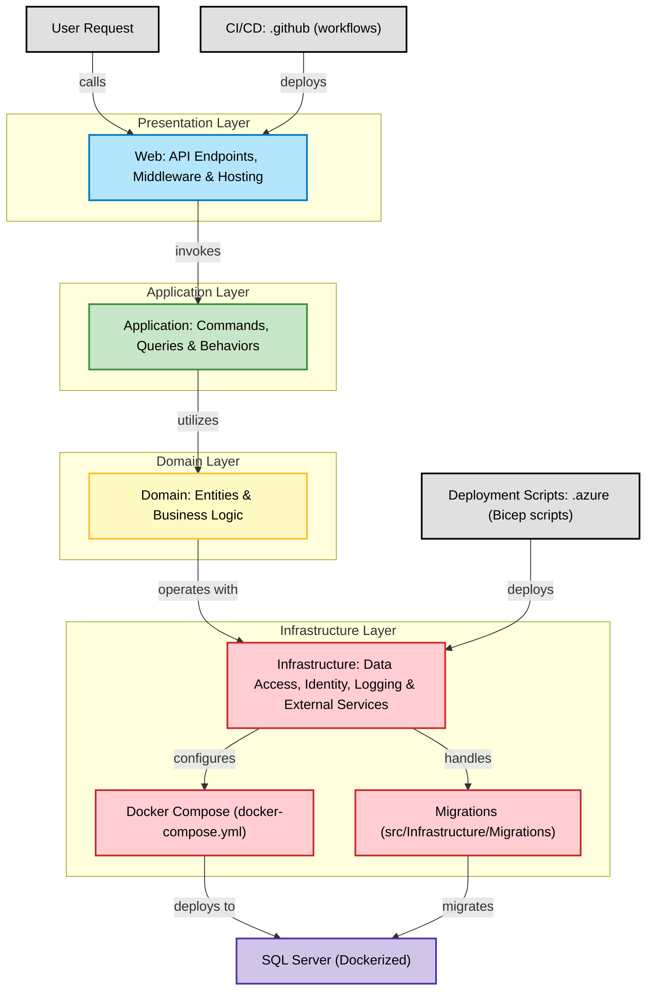

# LibraryApp - Digital Library Management System

This document provides a step-by-step guide on how to run the LibraryApp API from the command line.

## Overview

LibraryApp is a digital library management system that allows users to explore and manage books, authors, and genres. The application provides a RESTful API with JWT authentication and uses Entity Framework Core for data persistence.

## Key Features

- Complete CRUD operations for books, authors, and genres
- User authentication and authorization using JWT
- Search and filter capabilities for books
- Relationship management between books, authors, and genres
- Structured logging with Serilog
- API documentation with Swagger

## Prerequisites

Before you can run the application, you need to have the following software installed on your machine:

- .NET 8.0 SDK
- SQL Server (or Docker to run SQL Server in a container)

## Building and Running the Application

Once you have set up your environment, follow these steps to build and run the application:

1. **Clone the repository**:

```bash
git clone https://github.com/Oriel9511/LibraryApp.git
cd LibraryApp
```

2. **Run the database**:

The database for this application runs in SQL Server. You can use a local SQL Server instance or run it in a Docker container:

```bash
docker-compose up -d
```

3. **Add the user secrets to the Web project**

Use the example.secrets.json file as reference

4. **Build the application**:

```bash
dotnet build -tl
```

4. **Run the tests**:

```bash
dotnet test
```

6. **Run the application**:

```bash
dotnet watch run --project src\Web
```

After running the application, you should see output indicating that the application is running. The API will be available at https://localhost:5001.

## Accessing the API Documentation

Once the application is running, you can access the API documentation by opening a web browser and navigating to https://localhost:5001/api/index.html?url=/api/specification.json#/.

## Application Structure

The application follows Clean Architecture principles and is organized into the following layers:

- **Domain**: Contains the core business entities and logic
- **Application**: Contains application business rules and use cases
- **Infrastructure**: Contains implementation details for persistence, identity, and external services
- **Web**: Contains the API controllers and configuration

## Entity Model

The application manages the following entities:

- **Books**: Contains information about books including title, resume, publication year, ISBN, and stock
- **Authors**: Contains information about authors including name, nationality, and birthday
- **Genres**: Contains information about book genres including name and description
- **Users**: Manages user authentication and authorization

## API Endpoints

The API provides endpoints for:

- User registration and authentication
- Book management (create, read, update, delete)
- Author management
- Genre management
- Book searching and filtering

## Logging

The application uses Serilog for structured logging to track important operations and potential issues.

## Security

The API implements JWT-based authentication to secure endpoints and ensure that only authorized users can perform certain operations.

## Additional Information

For more detailed information about the API endpoints and data models, please refer to the Swagger documentation available when running the application.

 **Architecture**

